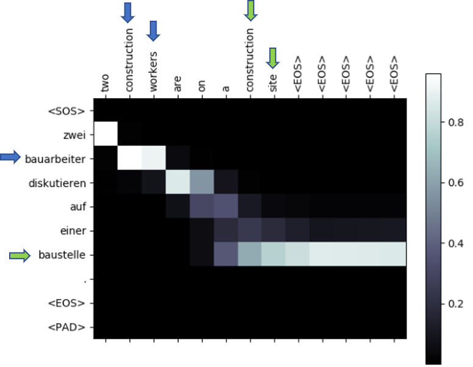
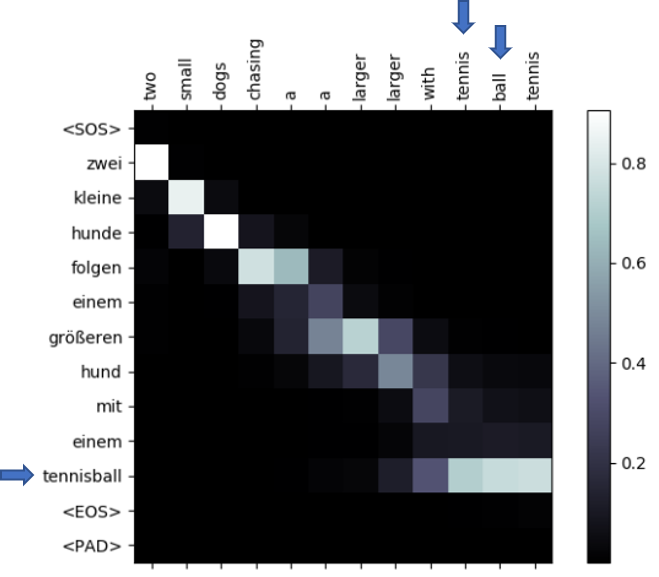

# Attentional Translation
This project is a pytorch implementation of the [Neural Machine Tanslation by Jointly Learning to Align and Translate](https://arxiv.org/abs/1409.0473) paper, for German to English translation based on the Multi30k dataset. <br>
The behaviour of two phenomena under that model were examined, that are unique to the German language: compound words and separable verbs. <br>
A more detailed discussion about the experiments and results can be found [here](https://github.com/ShlomoLibo/Attentional-Translation/blob/master/Neural%20Machine%20Translation%20by%20Jointly%20Learning%20to%20Align%20and%20Translate.pdf). 

## Compound Words
In German, sometimes words that are separate in other languages are compounded into a single word. For that reason, German is famous for having long words (<i> Mamutwoerter </i> – mammoth words).
For example:
-	<i> Was ist deine Liblingsfarbe? </i>

Translates to:
-	<i> What is your favorite color? </i>

Where <i>“Liblings”</i> corresponds to <i>“favorite”</i> and <i>“farbe”</i> corresponds to <i>“color”</i>. <br>
It is interesting to see whether the model will place its attention both when translating “favorite” and when translating “farbe”, or the attention will be placed only when translating one of the words and the rest will be carried through the hidden sates.

## Separable verbs
In German, one verb can be separated across the sentence. For example, the sentence:
-	<i> Ich mache meine Auge zu. </i>

Translates to:
-	<i>I close my eyes.</i>

Both <i>“mache”</i> and <i>“zu”</i> together represent a single verb, <i>“zumachen”</i> (to close). Without the information that <i>“zu”</i> is in the end of the sentence, the original sentence can also be <i>“Ich mache meine Auge auf”</i> (I open my eyes). <br>
Therefore, we expect that after translating <i>“I”</i>, attention will be placed both at <i>“mache”</i> and <i>“zu”</i>. 

## Example Results




A more detailed discussion about the experiments and results can be found [here](https://github.com/ShlomoLibo/Attentional-Translation/blob/master/Neural%20Machine%20Translation%20by%20Jointly%20Learning%20to%20Align%20and%20Translate.pdf)

## Requirements
Download the following ```.yml``` file for the required anaconda environment: [link](https://drive.google.com/file/d/1DQL8cr8L7LDoAeVV3_22i3xvWn3S4chs/view?usp=sharing)
<br>
To create the environment run:
```
conda env create -f attn_translation_env.yml
```
To activate the environment run:
```
conda activate attn_translation_env
```

Additionally, while the environment is activated, download the ```spacy``` tokenizer by running:
```
pip install spacy
```
and then:
```
python -m spacy download en
python -m spacy download de
```

## Training
To train the model run the following command:
```
python train.py --checkpoint_folder <checkpoint_folder>
```
Where each epoch will be saved into ``` <checkpoint_folder>```.

## Testing
To test the model simply run:
```
python test.py --checkpoint_folder <checkpoint_folder> --attention_vis
```
Where ```<checkpoint_folder>``` is the folder used in the training phase.
This will iterate through batches in the testing dataset, where the attentional diagrams for each sentence in the batch will appear in  ```<checkpoint_folder>_attentions```, to go to the next batch press ```enter```.
<br>
To test the model across the different epochs on the validation dataset run:
```
python test.py --checkpoint_folder <checkpoint_folder> --compare_validation
```

## Pre-Trained Model
You can find a pre-trained model [here](https://drive.google.com/file/d/1jQbOz1J0WomIHeFAEoMGUY69edSAzlhi/view?usp=sharing). <br>
Simply save it under ```<checkpoint_folder>/epoch_0.pth``` (insure there are no other files in this directory).
